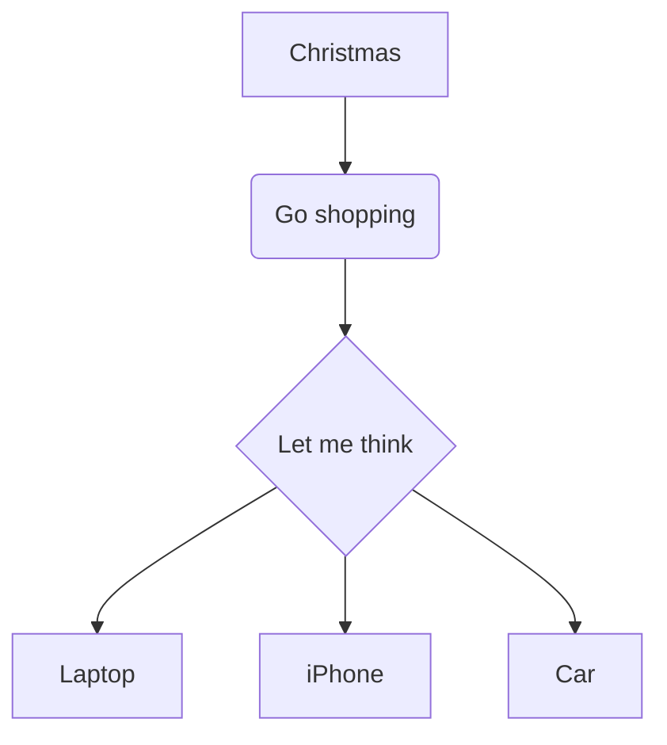

 <script type="text/javascript">

# tech-test

Mermaid graph:

```mermaid
graph TD
A[Christmas] --> B(Go shopping)
B --> C{Let me think}
C --> D[Laptop]
C --> E[iPhone]
C --> F[Car]
```

graph TD
A[Christmas] --> B(Go shopping)
B --> C{Let me think}
C --> D[Laptop]
C --> E[iPhone]
C --> F[Car]

